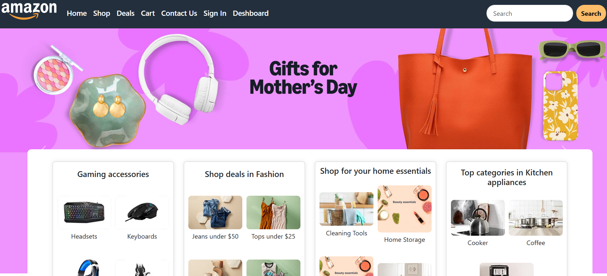

# Amazon Clone Website

This is a simple **Amazon Clone Website** built using only **HTML** and **CSS**. It mimics the basic layout and design of Amazon's homepage.
## Team
Shahmeer khan: 1 ( 332477)
Faizan : 2 ( 325405) not available
Abdullah : 3 ( 284777) not available

## Features

- Responsive design
- Header with logo, 
- Banner image
- Product cards section
- Deals page
- Footer

## Technologies Used

- HTML5
- CSS3 
- Boostrap

## Folder Structure
amazon-clone/
│
├── index.html
├── style.css
├── /images
│ └── (All website images used)
└── README.md

## Screenshots

## How to Run

1. Download or clone this repository.
2. Open the `index.html` file in any browser.
3. That’s it!

## Credits

This project was created by **Shahmeer** as part of a learning exercise.

## License

This project is open source and free to use for learning purposes.

